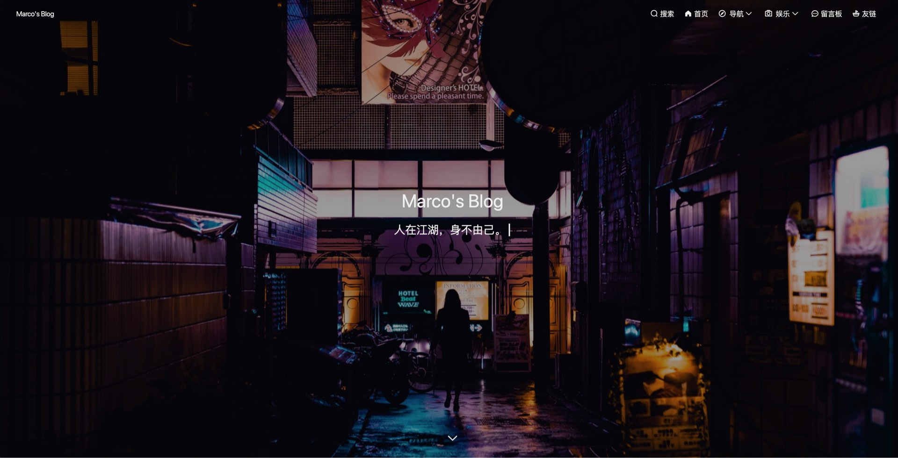

# vue-ssr-blog

<center>



</center>

## 介绍

这是一个使用 vue2.x 开发的，记录学习与生活的 [个人博客](https://mapblog.cn "Marcos's Blog")。
整站选用 ssr 技术进行服务端渲染，具备良好的 SEO 和首屏性能。  
同时，我为它配备了一个使用 vue3.x、typescript、vite 开发的管理系统，详情请移步 [这里](https://github.com/justJokee/vue-blog-admin) 查看。

## 主要功能

- [x] 首页
  - [x] 最新文章
- [x] 文章搜索（高亮关键词）
- [x] 导航
  - [x] 文章归档
  - [x] 文章标签
  - [x] 文章分类
- [x] 娱乐
  - [x] 电影（[爬虫](https://github.com/justJokee/douban-spider)获取豆瓣的观影记录）
    - [x] 看过的影视
    - [x] 想看的影视
    - [x] 在看的影视
- [x] 留言板
  - [x] 留言
  - [x] 相互回复
  - [x] 点赞、取消赞（ip统计）
- [x] 支持 QQ、Github 第三方登录，以支持评论及留言
- [x] 文章筛选
  - [x] 按标签
  - [x] 按分类
  - [x] 按归档时间
- [x] 文章相关
  - [x] 评论
  - [x] 回复评论
  - [x] 文章/评论的赞、取消赞（ip统计） 
  - [x] 分享 
- [x] 响应式
- [ ] 友链

## 启动前必读
在fork到本地启动前，请务必仔细阅读以下说明：
### 配置文件
在 `preinstall` hook中，系统将为你自动生成一份默认的配置文件至 `/server/db/secret.js`，它涵盖了数据库、管理系统、三方登录、七牛云等重要配置信息，以确保本项目正常启动，此文件进行了详细注释，因此你可以在项目启动前根据自己的实际情况进行修改。 
### 依赖
1. 安装mongodb，推荐5.x版本
2. mongodb中创建名为`/server/db/secret.js[db.db]`（默认配置为 “blog”）的数据库
3. mongodb中创建用户为`/server/db/secret.js[db.user/pwd]`（默认配置为 “admin 12345”）
4. 运行时node版本推荐 14.x,实测16.x安装依赖会失败，初步观察为node-sass版本兼容问题，因时间原因目前不打算排查升级

## Build Setup
关于部署至生产环境的详细教程，请查看[这篇文章](https://mapblog.cn/app/article/7)

```bash
# install dependencies

npm install

# serve with hot reload at localhost:6180

npm run dev

# build for production with minification

# 注意，此命令输出生产包至 dist 目录，部署时将 dist 下 的所有目录上传至你的静态服务目录，例如 /usr/local/nginx/htmls

npm run build

# serve for production
# 注意，如果你想在本地试运行生产包，请运行以下命令：

cd dist
npm run start:local

# 在生产服务器的静态服务目录中

npm i

# 直接使用node启动

npm run start

# 使用pm2启动

npm i pm2 -g
npm run pm2:prod

# 查看部署相关信息

pm2 show mapblog

```

## 技术栈
- vue2.x ssr
- vue-router
- vuex
- nodejs
- mongodb
- mongoose
- express
- pm2
- lazyload

## 预览

### 首页
<!--  -->
### 搜索

### 归档

### 标签

### 电影

### 留言板

### 文章筛选

### 文章详情页

## 其它